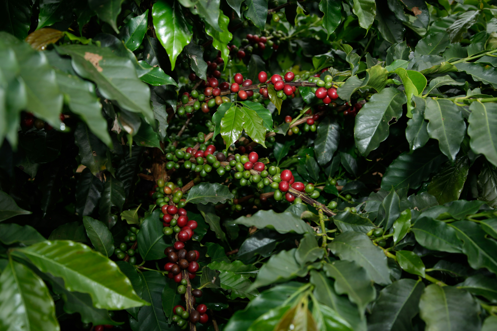

# ☕ Visualization of Coffee Plantation by Province in Indonesia and Export Analysis with FOB Value


This Streamlit web app presents visual insights into Indonesia's coffee plantation landscape by province and explores the export performance of coffee using Free on Board (FOB) values. The app is designed for interactive data exploration and analysis.

<p align="center">
  <br>
  <sub>
    Photo by <a href="https://unsplash.com/@projetocafegatomourisco?utm_content=creditCopyText&utm_medium=referral&utm_source=unsplash">PROJETO CAFÉ GATO-MOURISCO</a> on <a href="https://unsplash.com/photos/coffee-berries-growing-on-a-leafy-branch-w2_RA1-3NaU?utm_content=creditCopyText&utm_medium=referral&utm_source=unsplash">Unsplash</a>
  </sub>
</p>

## 📊 Features

- 📍 Visualization of coffee plantation area and production by province.
- 📈 Trend analysis of production and productivity over the years.
- 🌎 Export analysis based on FOB value of coffee exports.
- 🧩 Easy-to-use interactive interface powered by Streamlit.

## 🗂️ Dataset Used

- `Luas dan produksi.xlsx`  
  → Contains data on coffee plantation area and production in Indonesia by province.

- `Ekspor kopi dan FOB value.xlsx`  
  → Contains Indonesian coffee export data and FOB (Free on Board) value per year.

Make sure both Excel files are available in the same directory as the main Python file when running locally or deploying.

## Goals

Understanding Coffee Plantation Output by Province in Indonesia and Total Coffee Exported Abroad Along with Its FOB Value.

## Case Overview

Indonesia is one of the world’s largest coffee producers, with a significant contribution to the global coffee export market. However, there are challenges in understanding the distribution of plantation potential, land productivity, and coffee trade patterns in order to achieve optimal results. Analysis is essential to support decision-makers, coffee farmers, and entrepreneurs in optimizing policies, improving production efficiency, and enhancing the competitiveness of Indonesian coffee in the global market.

## Problem

1. Which province has the largest coffee plantation area and the highest production output?
2. Is there a balance between plantation area and production volume?
3. Which are the main destination countries with the highest FOB values and export volumes?
4. What is the ratio between coffee production that is exported and that which remains for domestic use?

## Activity of Project
- Data Collection
- Cleaning data
- Visualization
- Insight & Recommendation

## Visualization

1. **Top 5 Provinces with the Largest Coffee Plantation Area and Highest Production in Indonesia**
   <p align="center">
    <br>
    </p>
  It can be observed that the province with the largest coffee plantation area and highest production in Indonesia is South Sumatra.   According to Kompas, the ideal yield from coffee plantations ranges between 1 to 4 tons per hectare. Based on this benchmark, among the top five provinces, South Sumatra demonstrates the most optimal coffee plantation performance, where the ratio between plantation area and production output appears to be balanced compared to the other provinces

2. **Relationship Between Plantation Area and Coffee Production Output by Province**
   <p align="center">
    <br>
    </p>
  It can be observed that there is a positive correlation between coffee plantation area and production output. In other words, the larger the coffee plantation area, the higher the coffee production. The data distribution on the graph shows that most of the points are located in areas with smaller plantation sizes (below 100,000 hectares) and lower coffee production (below 50,000 tons). There is one outlier (the point at the far upper right) indicating a province with an exceptionally large plantation area (around 250,000 hectares) and also a very high production output (approaching 200,000 tons).

3. **Net Weight and FOB Value of Coffee Export Destination Countries**
   <p align="center">
    <br>
    </p>
    As seen in the chart above, the United States has a high net weight (blue bar) and FOB value (red line) for coffee exports. Among all the countries presented in the chart, coffee exported to the U.S. has a higher price per ton compared to other countries. This high FOB value may be due to several factors, such as the export of higher-priced coffee (premium coffee), a large export volume, or a high purchasing power in the market.

4. **Comparison Between Coffee Production Exported and Used for Domestic Consumption**
   <p align="center">
    <br>
    </p>
    From the chart, it is also clear that there is a significant gap between the amount of coffee exported and that used for domestic consumption. In 2023, Indonesia’s coffee exports accounted for 33.8% of total coffee production, while 66.2% of the coffee was used for other purposes (such as domestic consumption, stock, or losses in processing). Domestic demand holds a significant portion. This export dominance shows that only a small portion of domestic consumption is directed toward the international market.

## Insight

- There are provinces with large plantation areas but relatively low production, which indicates potential inefficiency in land use. Provinces with high efficiency (large production with small or medium plantation areas) could serve as examples or models for coffee farming practices.
- Coffee exported to the United States may be of higher quality (premium coffee) or have a large export volume, thus yielding a higher FOB value.
- Indonesia's coffee exports account for only 33.8% of total coffee production, which is approximately half of the coffee production directed toward domestic consumption.

## Recommendation
- Evaluate provinces with low production relative to plantation area to identify constraints, such as the lack of agricultural technology implementation, poor soil quality, and the presence of coffee plant pests or diseases.
- For students (e.g., university students), Community Service Programs (KKN) can be organized in provinces where coffee production is still suboptimal. The program can help coffee farmers maximize their yields, based on studies of coffee farming in South Sumatra.
- Combine plantation volume with quality improvement to create new market opportunities that can bring greater profits.
- Develop long-term export strategies focusing on emerging markets, and expand the marketing of Indonesian coffee as a premium product in the international arena.

## 🛠️ Built With

- **Python**
- **[Streamlit](https://streamlit.io/)** – For creating the web-based dashboard.
- **[Pandas](https://pandas.pydata.org/)** – For data processing.
- **[Matplotlib](https://matplotlib.org/)** and **[Seaborn](https://seaborn.pydata.org/)** – For data visualization.
- **OpenPyXL** – For reading Excel files (`.xlsx`).

## 📑 Data
 This data was taken from Badan Pusat Statistik (BPS)
 
## 📦 Requirements

Install the required Python libraries using:

```bash
pip install -r requirements.txt
```


## 👩‍💻 Author

**Sinta Miftakhul Rohmah**  
Applied Mathematics student  
Universitas Islam Negeri Sunan Kalijaga, Yogyakarta  
📫 [LinkedIn](https://www.linkedin.com/in/sintamiftakhulr/)
